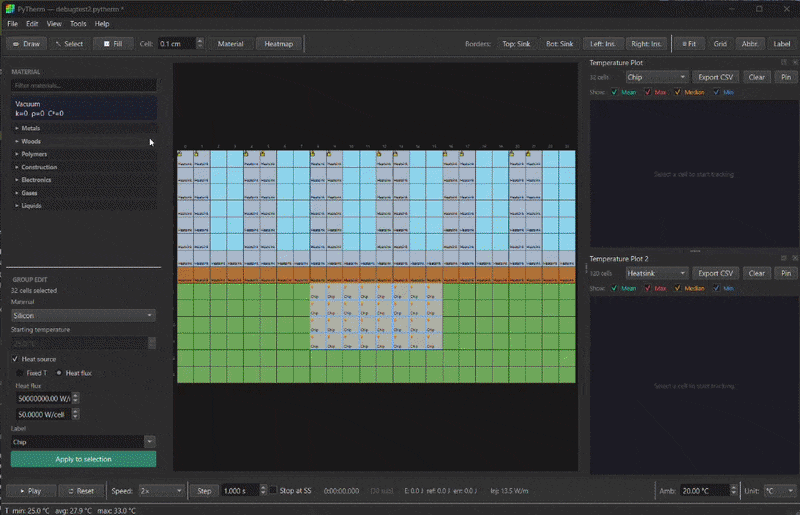

[](https://github.com/dukesmith0/pytherm/releases)
[](https://github.com/dukesmith0/pytherm/actions)
[](LICENSE)
[](https://python.org)
[]()

**PyTherm** is a 2D heat conduction simulator I built to explore how heat moves through different materials. Paint a grid of real engineering materials, set up heat sources and boundary conditions, and watch Fourier conduction happen in real time.

Under the hood it's an explicit finite-difference solver with per-cell CFL sub-stepping, harmonic-mean conductivity at material interfaces, and a library of 196 built-in materials. The whole thing runs on Python, PyQt6, and NumPy.



## Quick Start

### Standalone executable (no install)

Grab the latest build from the [Releases page](https://github.com/dukesmith0/pytherm/releases):

| Platform | File |
|----------|------|
| Windows | `PyTherm-Windows.exe` |
| macOS | `PyTherm-macOS` |
| Linux | `PyTherm-Linux` |

> **Windows:** The exe is unsigned. SmartScreen will warn on first launch -- click "More info" then "Run anyway."

### From source

```sh
git clone https://github.com/dukesmith0/pytherm.git
cd pytherm
pip install -r requirements.txt
python main.py
```

Requires Python 3.10+ with PyQt6 and NumPy.

## What it does

### Physics engine

- Solves the 2D transient heat equation using explicit FDM
- Harmonic mean of k at material interfaces (correct for thermal series)
- Per-cell CFL sub-stepping -- up to 2000x more efficient than a global CFL bound on mixed grids
- Fixed-temperature sources, constant heat flux (W/m^2 or W/m^3), and per-edge boundary conditions
- Real-time energy conservation tracking

### Materials

- 196 built-in materials across 26+ subcategories (metals, ceramics, polymers, gases, liquids, electronics, etc.)
- Custom material editor with import/export

### Visualization

- Material view, temperature heatmap, and heat flow rate -- three view modes
- Heat flow vector arrows with auto-decimation
- Isotherm contour lines and hotspot highlighting
- 4 color palettes (Classic, Viridis, Plasma, Grayscale) with reverse option
- Floating color legend, convergence graph, temperature-vs-time plots
- Light and dark themes

### Tools

- Draw, fill, select, copy/paste, undo/redo
- Thermal resistance report (R_th = dT/Q)
- Step history navigation, smooth step animation
- Command palette (Ctrl+Shift+P), 30+ keyboard shortcuts
- Save/load `.pytherm` files, export PNG and CSV
- 15 example templates

## How the solver works

```
1. Compute harmonic-mean interface conductances (k_r, k_l, k_u, k_d)
2. Per-cell CFL: dt_safe = 0.9 * min(rho_cp / k_sum) * dx^2
3. Sub-step: T_new = T + dt * flux * inv_rho_cp
4. Inject heat flux: dT += flux_q * dt / rho_cp
5. Re-pin fixed-T cells
```

| Decision | Why |
|----------|-----|
| Harmonic mean of k | Correct for materials in series -- arithmetic mean over-predicts by ~4000x |
| Center-cell rho*Cp | Each cell stores its own energy; interface-averaging violates conservation |
| Per-cell CFL | Global bound is ~2000x too conservative on mixed-material grids |
| Explicit Euler | CFL guarantees stability; simple, vectorizable, good enough for interactive use |
| Kelvin internally | No negative-temperature edge cases; unit conversion only at display layer |

## Scope and limitations

PyTherm models 2D transient conduction through heterogeneous isotropic materials with constant properties. It does **not** model convection, radiation, phase change, 3D geometry, contact resistance, or temperature-dependent material properties.

This makes it good for thermal layout studies, teaching, and first-order engineering estimates. For anything that needs certification or high accuracy, use a proper FEA/CFD tool.

## Keyboard shortcuts

| Key | Action |
|-----|--------|
| Space | Play / Pause |
| R | Reset |
| D / S / W | Draw / Select / Fill |
| Q | Cycle view (Material / Heatmap / Heat Flow) |
| F | Fit to window |
| G | Grid lines |
| P | Protect cells |
| [ / ] | Step history back / forward |
| Ctrl+Shift+P | Command palette |
| Ctrl+/ | Full shortcuts list |

## References

Material properties sourced from:

> Incropera, F.P. et al. (2011). *Fundamentals of Heat and Mass Transfer*, 7th ed. Wiley.

## License

MIT -- Craig "Duke" Smith, 2026. See [LICENSE](LICENSE).
